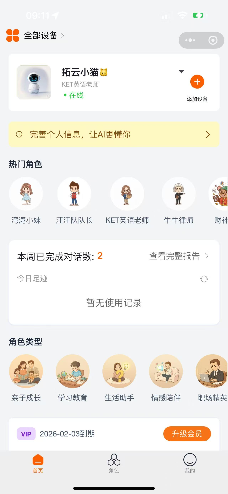
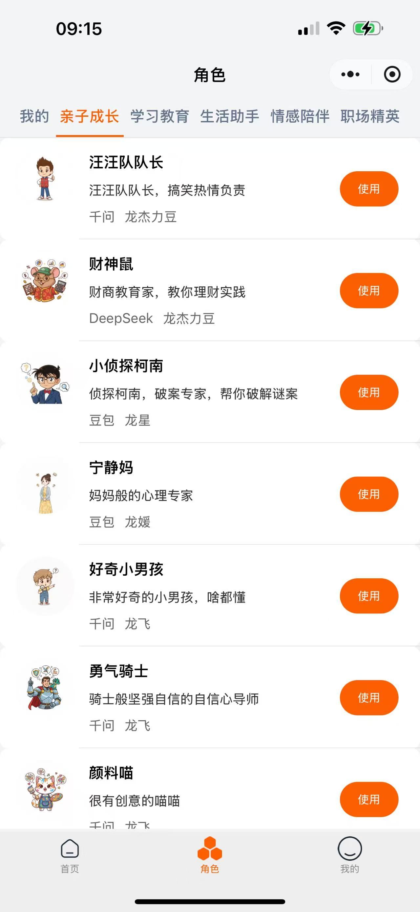
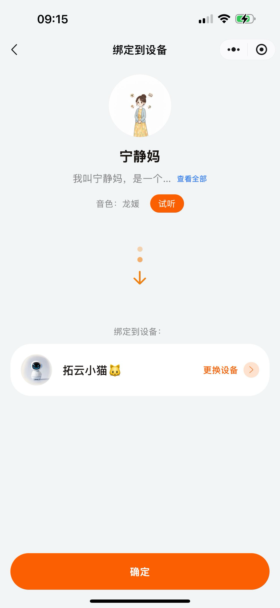
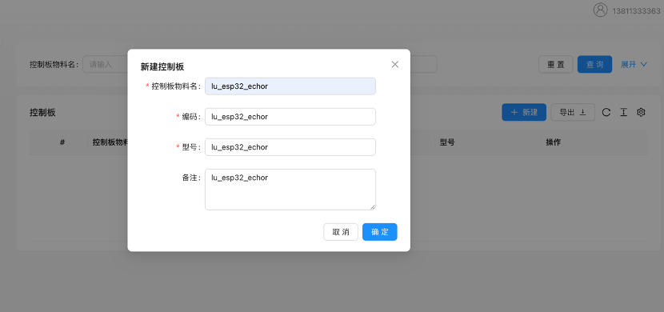
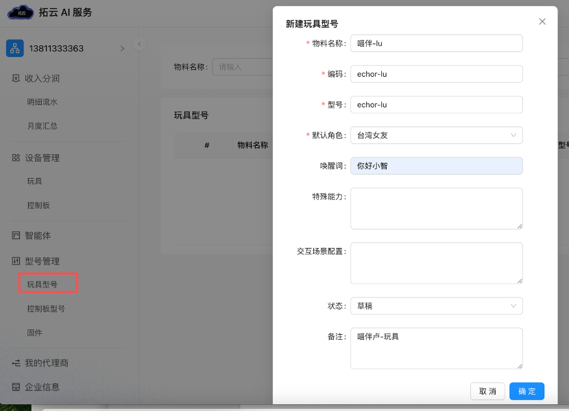
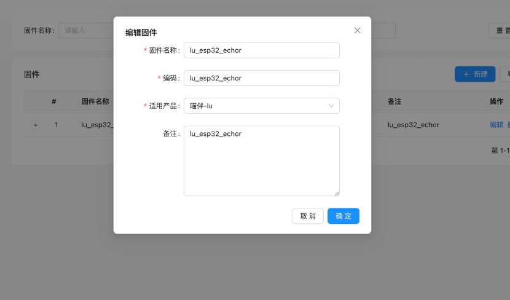
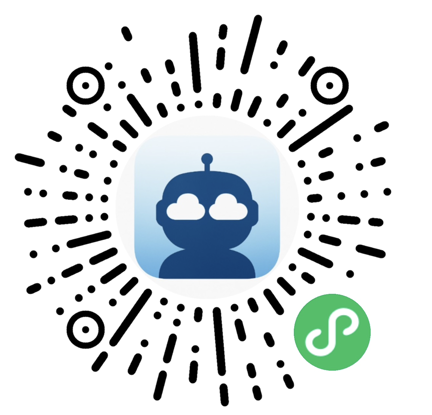
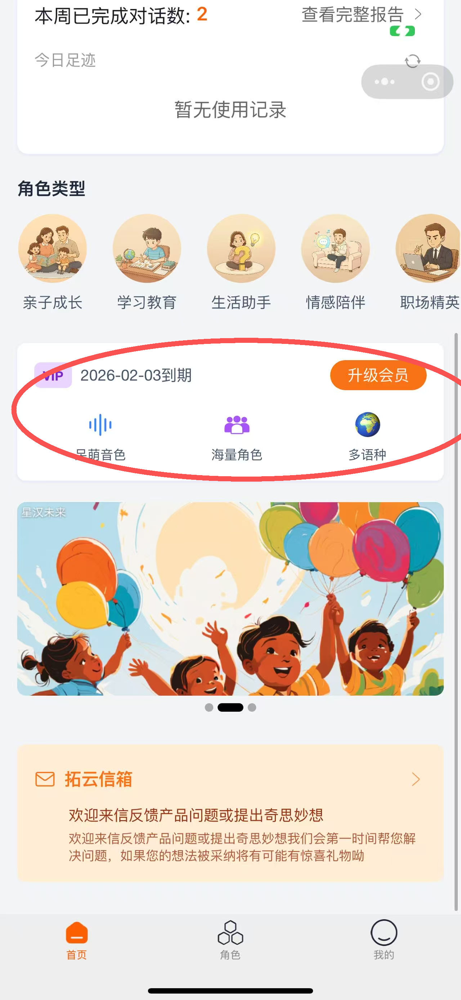
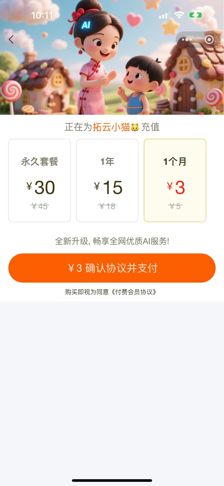

  
  <h1>拓云 tuoyun_jieli_ac792 项目</h1>
  <h3> <a href="https://www.lovaiot.com/">👉 拓云官网地址</a></h3>

## 拓云 AI 介绍

拓云 AI IoT 平台为硬件厂商提供一站式大模型接入解决方案，通过开源 SDK 快速集成 DeepSeek、通义千问、豆包等主流大模型，让传统硬件瞬间具备 AI 能力。
👉 [拓云官网地址](https://www.lovaiot.com/)

### 核心特性

#### 🔌 全方位 AI IoT 解决方案

从硬件接入到用户运营，拓云提供完整的 AI IoT 生态链服务，让您的智能硬件产品快速获得 AI 能力。

#### 📱 微信小程序

用户友好的配网小程序，支持设备绑定、参数配置、模型选择等功能：

- 一键配网连接
- TTS 语音设置
- 大模型参数调优
- 角色智能体管理和配置

  
  
  

#### 👥 用户运营

为硬件厂商提供用户运营平台，支持增值服务包销售和用户生命周期管理：

- 增值服务包管理
- 用户行为分析
- 智能推荐系统

#### ⚡ 高性能

毫秒级响应，支持大规模并发，智能负载均衡，确保服务稳定可靠：

- 99.9% 服务可用性
- 毫秒级响应时间
- 弹性扩容

#### 🤖 多模型支持

支持 DeepSeek、千问、豆包等主流大模型，一键切换，满足不同业务需求：

- 主流大模型全覆盖
- 智能模型选择
- 成本优化建议

### 已实现功能

- 小程序蓝牙配网，小程序角色管理
- 离线语音唤醒
- MQTT+UDP 协议
- 电量显示与电源管理
- 支持多语言（中文、英文、日文）
- 小程序虚拟服务购买等
- ota 管理

## 硬件

因为服务端兼容了原来的协议，所以理论上所有原来的
硬件都能支持

### 接入说明

这里有对原有项目的接入文档说明：
👉 [详细编码指导文档](docs/tuoyun/拓云平台接入编码指导.md)

#### 1. 拓云 AI 厂商合作伙伴账户注册

为了接入拓云平台，需要先注册一个厂商账户，后续的产品管理、固件 OTA 管理等功能都在这个后台完成。

👉 [拓云厂商注册地址](https://agent.lovaiot.com/)

#### 2. 合作伙伴型号管理

拓云平台定义了三种基础物料型号，用于组成一个完整的 AI 硬件产品：

- **玩具型号**：产品的外观形态（如 AI 小熊、AI 机器人等）
- **控制板型号**：硬件控制板型号（如 ESP32-S3 开发板）
- **固件**：运行在控制板上的固件版本

##### 2.1 控制板添加

登录厂商后台，点击左侧的"型号管理" → "控制板型号" → "添加控制板"，填写控制板信息。

##### 2.2 玩具型号添加

点击左侧"玩具型号管理" → "添加玩具型号"，填写产品信息。

##### 2.3 固件添加

点击左侧"固件管理" → "添加固件"，在"适用产品"中选择上面添加的玩具型号。

## 开发板介绍

tuoyun_jieli_ac792 是北京拓云基于杰理 792 系列芯片开发语音对话开发板，
目前实现的功能：

1.  小杰小杰 语音唤醒
2.  语音对话，支持千问，deepseek,豆包等国内主流大模型
3.  支持对话过程中用“小杰小杰”唤醒词打断
4.  小程序蓝牙配网
5.  支持使用 ‘拓云 AI’ 小程序 进行角色和模型的切换

# 项目概述

本项目基于杰理 AC792 平台 SDK 开发。杰理 SDK 部分代码开源，开源部分的代码还在快速迭代升级中。小版本的升级中也会有比较多的源码优化变动；开源 SDK 中的样例项目包含的功能涵盖多种场景应用，业务功能相对比较复杂；部分 Demo 代码与业务代码交织在 demo 目录和基础模块目录中。部分模块的功能包含基础模块的头文件，但是 SDK 中存在同名的头文件,  如 debug.h 等，导致项目工程（或 makefile）的头文件包含顺序会影响编译结果。基于这些情况，本项目没有严格遵循官方 SDK 的开发策略，如下：

1.  创建新的项目文件，尽量最小化引入 SDK 模块依赖；工程文件的模块按名称顺序导入；
2.  /smart_robot/目录下的模块称为应用层；其他官方定义的目录称为(官方)基础模块；
3.  对有重名的官方头文件的引入，在引入时通过增加目录名指定头文件，提高项目编译的确定性；
4.  严格避免使用诸如"demo"的目录或路径;
5.  应用模块不直接使用官方的代码；通过对官方代码的修订和简化，并把代码放在/smart_robot 目录下；
6.  应用层的所有模块的头文件统一放在/smart_robot/include/目录下;
7.  结构体、枚举值定义统一通过 typedef 修饰，以"\_t"结束命名，以"\_ptr"结束命名对应的指针类型。

# 项目模块说明

## 自定义事件

杰理 SDK 支持通过事件分发机制，可以在各个模块之间解耦通信。由于官方 SDK 没有为应用层预留事件值空间，事件定义文件放置在基础模块目录。为了减少对官方基础模块的侵入，项目定义了一套基于  `sys_event_notify`  的事件分发机制，用于各模块间的解耦通信。

- **头文件**: /smar_robot/include/app_event.h
- **模块目录**： /smar_robot/event
- **模块接口**:

  - 定义了统一的事件结构体  `struct app_event`。
  - 支持不同应用层模块来源  (`enum app_event_from`)  的事件通知。
  - 提供  `app_event_notify`  接口，允许模块发送系统级事件，由主循环或特定任务进行处理。

- **说明**

  - 根据测试，SDK 的时间分发机制的处理是同步的，所以时间处理函数中不应该有阻塞或长耗时操作。

## 蓝牙配网

通过低功耗蓝牙  (BLE)  实现设备的  Wi-Fi  网络配置功能。在配网的过程中，设备需要通过蓝牙上传厂商编码(UID)、产品类型编码和设备的 Flash Unique ID。对于  NAND Flash  芯片本身，它通常会有一个  **Unique ID (UID)  或  Serial Number**。这个  UID  或序列号在出厂时就固化在每个独立的  NAND  芯片内部，是唯一的。  这种  ID  主要用于底层硬件的安全配对或芯片管理。项目中使用这个 flash UID 来作为设备的唯一标识。请注意不同的设备的 flash UID 的长度可能不一样。

移动端通过 BLE 向设备写入可用的 WiFi 热点的 SSID 和密码。

- **头文件**: /smar_robot/include/app_ble.h
- **模块目录**：/smart_robot/bt_ble，/smart_robot/wifi
- **模块接口**:

  - 蓝牙配网初始化:   初始化蓝牙配网模块，进入配网模式。

## OTA 升级

本项目支持通过  HTTP  协议进行固件的远程空中升级。项目摒弃 SDK 中的版本号管理，采用语义化版本，只需更新 FIRMWARE_VERSION 宏定义值，即可在设备开机的时候触发 OTA 升级。

更新版本号时，  不需要更新 BR22_TWS_VERSION。但是请遵循 SDK 中的说明，执行批命令制作升级文件。

- **头文件**: /smar_robot/include/app_ota.h

- **模块目录**：/smart_robot/ota
- **模块接口**:

  - 开机注册:   设备开机后需要调用注册函数，向平台注册设备，获取通讯接入参数。

## 会话协议

设备与服务器的协议包括通话控制、MCP、语音媒体数据传输 3 个协议。

- **头文件**: /smar_robot/include/app_protocol.h

- **模块目录**：/smart_robot/protocol

### 2.4.1  信令传输

项目采用 MQTT 协议传输服务器与设备之间的控制指令(包括 SIP 和 MCP)。官方 SDK 集成 IBM 开源的 MQTT 协议栈。该协议栈不支持接收、发送并行，也不支持在接收处理中嵌套调用发送函数，如果没有遵循这个约束，协议栈会引起非法指针访问。

### 2.4.2  通话控制协议

项目采用 SIP 协议进行会话控制。项目的 SIP 协议报文定义请参考“拓云 AI IOT 平台设备接入手册 2.0”。目前项目的 SIP 信令仅支持 mqtt 传输，不支持 websocket。项目 SIP 编解码采用开源 SIP 协议库 OSIP。

### 2.4.3 MCP 协议

项目支持的 MCP 协议版本是"2024-11-05"。

### 2.4.4  语音媒体传输

项目采用 UDP 传输语音数据。目前上行、下行语音都仅支持无封装的 OPUS 编码。由于网络传输中，可能是由于设备的 WiFi 链路层有大量的重传，语音报文的序号检测和去重必不可少。

在会话初始化完成后，设备需要持续向服务器发送空语音报文,  用于打通 UDP 通道。目前的策略是收到下行语音报文时，停止发送上行空语音包。

## 语音处理

负责音频的采集、编码、传输以及播放，支持全双工语音交互。

- **核心实现**: app_audio.c
- **头文件**: /smar_robot/include/app_protocol.h

- **模块目录**：/smart_robot/protocol

- **功能**:

  - **音频采集**:  使用  `tuoyun_voice_recorder`  模块采集麦克风数据。
  - **音频播放**:  使用  `tuoyun_flow_player`  模块播放网络下发的音频流。
  - **编解码**:  支持  Opus  编码格式  (`g_audio_enc_media_param`)，采样率  16kHz。
  - **流式传输**:  实时发送录音数据包，并接收播放数据包。
  - **状态管理**:  维护麦克风和扬声器的工作状态（Start/Stop/Pending）。

## 原理图

项目原理图和 PCB 文件位于 [hardware](hardware/) 目录，主要文件包括：

- [AC7923A_AI.sch](hardware/AC7923A_AI.sch)
- [AC7923A_AI.pcb](hardware/AC7923A_AI.pcb)

## 用户 UI

开发中...

## 日志服务

官方 SDK 的日志需要通过串口输出。如果没有开发板，那么获取日志打印的的手段受限。鉴于这种情况，项目中引入 Telnet Server 日志输出模块。当终端连上 WiFi 并成功获取 IP 后，会打开 TCP 6000 端口，在 6000 端口输出日志打印。

项目的 Telnet Server 模块通过  `app_config.h`的 TELNET_LOG_OUTPUT 宏定义开关。

#### 4. 设备使用

烧录固件后，用户可以通过"拓云 AI"小程序完成以下操作：

1. **添加设备**：扫描上方二维码进入拓云 AI 小程序
2. **蓝牙配网**：通过蓝牙完成网络配置
3. **绑定智能体**：选择并绑定 AI 智能体角色

配置完成后即可开始使用 AI 对话功能。

#### 5. vip 体验购买

需要说明的是，大模型对话模型并非免费,可以点击小程序的 vip 购买一下，如果只是为了体验，可以先买一个 3 元的包月服务

  
  

## QQ 交流群

  

